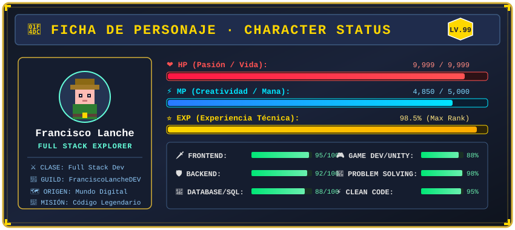
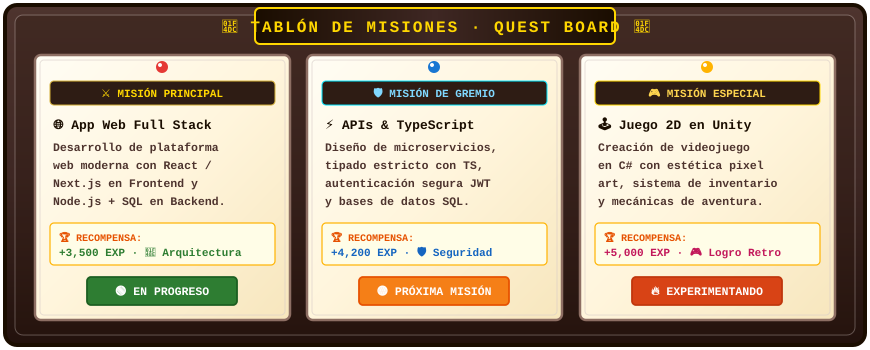
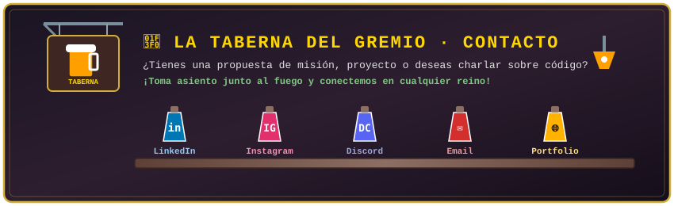

<!-- ========================================================
     ZONA 1: EL ARCADE MEDIEVAL · HEADER ANIMADO
     ======================================================== -->

  

<!-- ========================================================
     ZONA 2: FICHA DE PERSONAJE · CHARACTER STATUS
     ======================================================== -->

 

  

<!-- ========================================================
     ZONA 3: EL COFRE DEL ARSENAL · TECH STACK & INVENTARIO
     ======================================================== -->

 

 

### ⚔️ Equipamiento y Habilidades en Batalla

  <!-- Frontend -->
  
  
  
  
  
  
   
  <!-- Backend -->
  
  
  
  
  
   
  <!-- Databases & Tools -->
  
  
  
  
  

 

<!-- ========================================================
     ZONA 4: SALÓN DE TROFEOS · ESTADÍSTICAS DEL REINO
     ======================================================== -->

 

<h2>🏆 SALÓN DE TROFEOS Y LOGROS 🏆</h2>

  

<table align="center" border="0">
  <tr>
    <td align="center">
      
    </td>
    <td align="center">
      
    </td>
  </tr>
</table>

  

 

<!-- ========================================================
     ZONA 5: LA ARENA DE LA SERPIENTE · CONTRIBUTION SNAKE
     ======================================================== -->

 

<h2>🐍 LA ARENA DE LA SERPIENTE DEVORADORA DE CÓDIGO</h2>

  <picture>
    <source media="(prefers-color-scheme: dark)" srcset="https://raw.githubusercontent.com/FranciscoLanche05/FranciscoLanche05/output/github-contribution-grid-snake-dark.svg">
    <source media="(prefers-color-scheme: light)" srcset="https://raw.githubusercontent.com/FranciscoLanche05/FranciscoLanche05/output/github-contribution-grid-snake.svg">
    
  </picture>

 

<!-- ========================================================
     ZONA 6: TABLÓN DE MISIONES · PROYECTOS Y REPOSITORIOS
     ======================================================== -->

 

 

<table align="center" width="100%">
  <tr>
    <td width="50%" valign="top">
      <h3 align="center">🌟 Misiones Destacadas</h3>
      <ul>
        <li>🛡️ <b>Desarrollo Full Stack</b>: Aplicaciones dinámicas con frontend moderno y APIs robustas.</li>
        <li>⚔️ <b>Arquitectura Limpia</b>: Código modular, estructurado y optimizado para alto rendimiento.</li>
        <li>🎮 <b>Lógica &amp; Interactividad</b>: Experiencias de usuario inmersivas con mecánicas fluidas.</li>
      </ul>
    </td>
    <td width="50%" valign="top">
      <h3 align="center">📜 Registro de Repositorios</h3>
      

        ¡Explora mis más de <b>35+ repositorios</b> y acompáñame en cada aventura de código!
      

      

        
      

    </td>
  </tr>
</table>

 

<!-- ========================================================
     ZONA 7: LA TABERNA DEL GREMIO · CONTACTO Y REDES
     ======================================================== -->

 

 

  
  &nbsp;
  
  &nbsp;
  
  &nbsp;
  
  &nbsp;
  

 

<!-- ========================================================
     ZONA 8: CONTADOR DE VISITANTES DEL REINO
     ======================================================== -->

 

  

  <i>⚔️ Desarrollado con pasión, creatividad y código por <b>Francisco Lanche</b> ⚔️</i>

